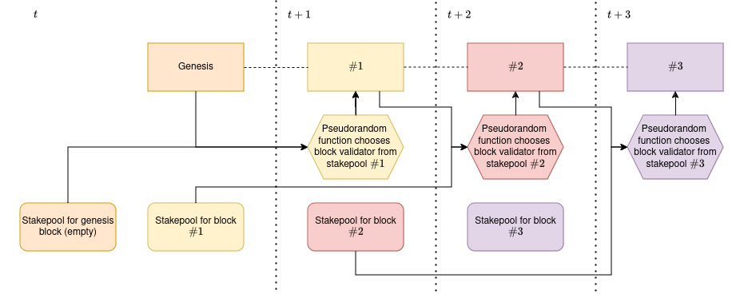

## 1. Introduction
This directory contains the PoCs of attacks on a PoS-powered blockchain networks. Due to the problematically specific nature of the attacks and ethical concerns, We decided to approach the attacks differently than the attacks on the PoW protocol. Instead of using an existing client, we wrote our own (<a href=https://github.com/Kokosardino/vulnCoin>vulnCoin</a>). As was outlined in the thesis, the client itself is very unsafe and should be used for no other purposes than conducting the prepared attacks on it. Whole setup of the environment can be found in the folder `Network-real`. Troughout the testing, we found out that the network client brings unnecessary complexity to the attacks. That is why we also offer version of the grinding attack that only simulates the network. It can be found in the folder `Network-simulation`.

## 2. Block Validation
 **DISCLAIMER**: The following is a implementation of a very vulnerable and inherently flawed consensus protocol. Under any circumstances do not attempt to build your consensus protocol to implement concepts described below.

For quick reference, the explanation of how the consensus mechanism we implemented works following:

 </img>

`t`
 * The `genesis` block is created automatically by the network.
 * The network users can stake for a chance to be selected as creator of the block `#1`, but the stakePool has to be finalised before the time `t+1`.

 `t+1`
 * The stakepool for the `genesis` block and the `genesis` block are used as inputs for the pseudorandom function that selects the block creator from the stakepool `#1`.
 * The stakepool for the block `#2` is opened.

 `t+2`
 * The stakepool for the block `#1` and the block `#1` are used as inputs for the pseudorandom function that selects the block creator from the stakepool `#2`.
 * The stakepool for the block `#3` is opened.

 The whole process continues in the same fashion until the network is stopped.
 
 ## 3. Pseudorandom Function

 Let $H$ represent `SHA256` hash of the last block in the blockchain, $\{a_1, a_2, \dots,a_n\} \in S$ a stakepool where each vulnCoin address $a$ of the coin holder is represented as hexadecimal string and $N$ number of addresses in the current stakepool. Furthermore, consider the function $\text{first32bits}()$ that returns the first 32 bits of a string. The pseudorandom selection function is implemented as:

 $$ \text{IndexOfValidator} \equiv (\text{first32bits}(H) + \text{first32bits}(a_1) + \dots + \text{first32bits}(a_n))\mod{N} $$

## 4. Setup
**Only follow this section if you choose not to use prepared VMs!**

On the `attacker` machine, navigate into the folder `network-real` and run:
 
`./scripts/installAttacker.sh`

On the `victim` machines, navigate into the folder `network-real` and run:
 
`./installVictim.sh`

Check that a folder `~/attacks` was created on the `attacker` machine. Please note that the PoCs in the `network-simulation` do not require any additional setup. You can simply run make in the folder and start them!

## 5. Environment

Before executing the PoC scripts, it is also important to add generated ssh key as trusted to all the other nodes. In aim to achieve high flexibility of the testing environment, we decided to save IP addresses as environmental variables. This approach left us with the need to define a configuration file that sets up the network properties. To find it, navigate into `~/attacks/exportVariables.sh` and change the values to fit your network setup. After doing so, run the script **in the current shell** with command:

`. exportVariables.sh`

During PoCs, we are starting and stoping a server on specified port via `cpp` program. After stopping the server on a port, the system needs time to clean it up. Therefore, issuing PoC in a short time on the same port can cause connectivity issues. The `exportVariables.sh` fights these issues by decrementing a `PORT` variable by one each time it is run. We recommend setting up the initial port number high (e.g. 10000) and running `exportVariables.sh` before each start of a PoC script.